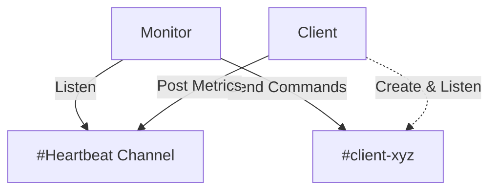

# Lortnoc - Remote Control & Monitoring

Lortnoc is a centralized fleet management and monitoring solution for devices (Raspberry Pi, Servers, IoT).

This project aims to be **simple**, **lightweight**, and **extensible**.

## 🏗 Architecture

The architecture relies on an asynchronous **Publisher/Subscriber** model using **Discord** as a communication bus.

### Dynamic Channel Routing
To ensure scalability and avoid single-channel overload:
1.  The **Client** announces itself on a global HEARTBEAT channel.
2.  The **Client** creates (if necessary) and listens to a dedicated COMMAND channel (named after its normalized client ID, e.g., `client-xyz`).
3.  The **Monitor** dynamically discovers these channels via heartbeats and subscribes to them to send commands.



## 📦 Components

### 1. `lortnoc-monitor` (The Brain)
- **Interface**: Web Dashboard (NiceGUI).
- **Role**: Orchestrator, log visualizer, command emitter.
- **Stack**: Python, NiceGUI, discord.py.

### 2. `lortnoc-client` (The Arms)
- **Role**: Lightweight agent running on target machines.
- **Stack**: Python (Standard Lib + psutil + discord.py).
- **Features**:
    - Metrics reporting (CPU, RAM, Temperature, IP).
    - System command execution (Reboot, Shutdown, Shell).
    - Autonomous management of its communication channel.

## 🚀 Installation

### 1. Discord Configuration (Bot)

For Lortnoc to function, the Bot must have permissions to read messages and create channels.

1.  **Create an Application**:
    *   Go to the [Discord Developer Portal](https://discord.com/developers/applications).
    *   Create a "New Application".
2.  **Configure the Bot**:
    *   Menu **Bot** > "Add Bot".
    *   **IMPORTANT**: Under "Privileged Gateway Intents", enable **"Message Content Intent"**.
    *   Copy the **Token**.
3.  **Invite the Bot**:
    *   Menu **OAuth2** > **URL Generator**.
    *   Check **Scopes**: `bot`.
    *   Check **Bot Permissions**: `Administrator` (Recommended to avoid 403 errors) or at least `Manage Channels` + `Read Messages` + `Send Messages` + `Attach Files`.
    *   Use the generated URL to invite the bot to your server.
4.  **Prepare the Server**:
    *   Create a text channel for heartbeats (e.g., `#lortnoc-heartbeat`).
    *   Enable **Developer Mode** in your Discord settings (App Settings > Advanced) to copy the Channel ID.

### 2. Monitor Installation (Server Side)

The monitor handles the web dashboard and orchestrates the fleet. It runs inside a Docker container for isolation and ease of update.

**Requirements**: `curl`, `docker`.

Run the following command on your server (replace `/opt/lortnoc_monitor` with your desired path):

```bash
curl -sL https://raw.githubusercontent.com/pebdev/lortnoc/master/tools/scripts/installer.sh | bash -s -- monitor /opt/lortnoc_monitor
```

This will:
1. Download the latest version.
2. Build the Docker image.
3. Ask for your Discord Token and Admin Password interactively.
4. Start the monitor.

Access the dashboard at: `http://<server-ip>:8080`

### 3. Client Installation (Device Side)

The client runs directly on the host machine (Raspberry Pi, VPS, etc.) within a Python Virtual Environment.

**Requirements**: `curl`, `python3`.

Run the following command on each device:

```bash
# Install to default home directory (~/lortnoc_client)
curl -sL https://raw.githubusercontent.com/pebdev/lortnoc/master/tools/scripts/installer.sh | bash -s -- client ~/lortnoc_client
```

This will:
1. Download the latest version.
2. Create a virtual environment (`.venv`).
3. Ask for Client Name and Discord Token interactively.
4. **(Optional)** Offer to create a Systemd service to start the client automatically on boot.
5. The client is ready to run.

> **Manual Start**: You can start the client manually using `~/lortnoc_client/tools/scripts/run.sh`.

## ⚙️ Configuration Reference

The configuration is stored in `config/config.json`.

```json
{
  "client_name": "My-Device-01", 
  "heartbeat_interval": 60,
  "discord": {
    "token": "YOUR_BOT_TOKEN",
    "heartbeat_channel_id": "123456789012345678"
  }
}
```
**Fields :**
* `admin_password` (Monitor Only): Password to access the web dashboard.
* `otp_enabled` (Monitor Only): Enable Two-Factor Authentication via Discord channel `#authentication`.
* `client_name` (Client Only): Unique identifier for this device.
* `discord.token`: Your Bot Token (Required).
* `discord.heartbeat_channel_id`: The centralized channel ID.

## 💻 Development & Testing

You can use the provided Docker tools to run environments locally.


## 🛠 Maintenance (Self-Update)

All updates are centralized and managed via the **Monitor Web Interface**.

*   **Clients**: You can trigger a self-update command from the dashboard for any specific client.
*   **Monitor**: The monitor can also update itself via the interface (rebuilds and restarts the container).


## Todo
- [x] mechanim to identify available updates for both monitor and clients
- [x] add "las activity" timestamp for clients on the monitor dashboard
- [x] provide a way to remove clients from the monitor dashboard
- [ ] add more system metrics (disk usage, network stats, etc.)
- [x] double authentication mechanism for monitor web interface
- [ ] implement encrypted communication between client and monitor
- [ ] security audits and hardening