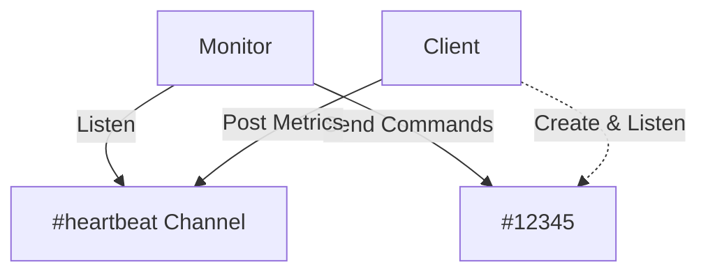

# Lortnoc - Remote Control & Monitoring

Lortnoc is a centralized fleet management and monitoring solution for devices (Raspberry Pi, Servers, IoT).

This project aims to be **simple**, **lightweight**, and **extensible**.

## 🏗 Architecture

The architecture relies on an asynchronous **Publisher/Subscriber** model using **Discord** as a communication bus.

### Dynamic Channel Routing
To ensure scalability and avoid single-channel overload:
1.  The **Client** announces itself on a global HEARTBEAT channel.
2.  The **Client** creates (if necessary) and listens to a dedicated COMMAND channel.
3.  The **Monitor** dynamically discovers these channels via heartbeats and subscribes to them to send commands.




## 📦 Components

### 1. `lortnoc-monitor` (The Brain)
- **Interface**: Web Dashboard (NiceGUI).
- **Role**: Orchestrator, log visualizer, command emitter.
- **Stack**: Python, NiceGUI, discord.py.

### 2. `lortnoc-client` (The Arms)
- **Role**: Lightweight agent running on target machines.
- **Stack**: Python (Standard Lib + psutil + discord.py).
- **Features**:
  - Metrics reporting (CPU, RAM, Temperature, IP, etc.).
  - System command execution (Reboot, Shutdown, Shell).
  - Autonomous management of its communication channel.


## 🚀 Installation

### 1. Discord Configuration (Bot)

For Lortnoc to function, the Bot must have permissions to read messages and create channels.

1.  **Create an Application**:
  *   Go to the [Discord Developer Portal](https://discord.com/developers/applications).
  *   Create a "New Application".
2.  **Configure the Bot**:
  *   Menu **Bot** > "Add Bot".
  *   **IMPORTANT**: Under "Privileged Gateway Intents", enable **"Message Content Intent"**.
  *   Copy the **Token**.
3.  **Invite the Bot**:
  *   Menu **OAuth2** > **URL Generator**.
  *   Check **Scopes**: `bot`.
  *   Check **Bot Permissions**: `Administrator` (Recommended to avoid 403 errors) or at least `Manage Channels` + `Read Messages` + `Send Messages` + `Attach Files`.
  *   Use the generated URL to invite the bot to your server.
4.  **Prepare the Server**:
  *   Create a text channel for heartbeats (e.g., `#heartbeat`).
  *   Enable **Developer Mode** in your Discord settings (App Settings > Advanced) to copy IDs (Channel ID, User ID).

### 2. Monitor Installation (Server Side)

The monitor handles the web dashboard and orchestrates the fleet. It runs inside a Docker container for isolation and ease of update.

**Requirements**: `curl`, `docker`.

Run the following command on your server (replace `/opt/lortnoc_monitor` with your desired path):

```bash
curl -sL https://raw.githubusercontent.com/pebdev/lortnoc/master/tools/scripts/installer.sh | bash -s -- monitor /opt/lortnoc_monitor
```

This will:
1. Download the latest version.
2. Build the Docker image.
3. Ask for settings interactively.
4. Start the monitor.

Access the dashboard at: `http://<server-ip>:8080`

### 3. Client Installation (Device Side)

The client runs directly on the host machine (Raspberry Pi, VPS, Docker container, etc.) within a Python Virtual Environment.

**Requirements**: `curl`, `python3`.
**Permissions**: The user running the client must have **passwordless sudo rights** if you intend to use `reboot` or `shutdown` commands.
*   *Add to sudoers*: `username ALL=(ALL) NOPASSWD: /sbin/reboot, /sbin/shutdown`

Run the following command on each device:

```bash
curl -sL https://raw.githubusercontent.com/pebdev/lortnoc/master/tools/scripts/installer.sh | bash -s -- client /opt/lortnoc_client
```

This will:
1. Download the latest version.
2. Create a virtual environment (`.venv`).
3. Ask for settings interactively.
4. **Auto-generate a unique Client ID** (stored in config).
5. **(Optional)** Offer to create a Systemd service to start the client automatically on boot.
6. The client is ready to run.

> **Manual Start**: You can start the client manually using `/opt/lortnoc_client/tools/scripts/run.sh`.

### 4. Client Installation (in a Custom Docker Image)

You can integrate the Lortnoc Client directly into your own applications' Docker images (e.g., for monitoring a specific service).

Add the following to your `Dockerfile`:

```dockerfile
# 1. Install Dependencies
RUN apt-get update && apt-get install -y curl python3 python3-venv sudo tzdata

# 2. Install Lortnoc Client
RUN curl -sL https://raw.githubusercontent.com/pebdev/lortnoc/master/tools/scripts/installer.sh | bash -s -- client /opt/lortnoc_client --install

# 3. Configure
# You should mount the real config.json at runtime via a volume
COPY config.json /opt/lortnoc_client/config/config.json

# 4. Start (Background)
# Use a Supervisor or an entrypoint script to run your app AND lortnoc
# ENTROPOINT ["/opt/lortnoc_client/tools/scripts/run.sh", "client", "&"]
```

## ⚙️ Configuration Reference

The configuration is stored in `config/config.json`.

```json
{
  "admin_password"    : "StrongPassword123!",       (Monitor Only)
  "admin_discord_id"  : "987654321098765432",       (Monitor Only)

  "client_id"         : "173840123-5678",
  "client_name"       : "My-Device-01", 
  "heartbeat_interval": 60,
  "log_file"          : "/tmp/lortnoc.log",

  "discord": {
    "encryption_key"        : "",
    "token"                 : "YOUR_BOT_TOKEN",
    "heartbeat_channel_id"  : "123456789012345678"
  }
}
```
**Fields :**
* `admin_password`   (Monitor Only) : Password to access the web dashboard.
* `admin_discord_id` (Monitor Only) : Your Discord User ID (required for OTP).
* `client_id`         (Client Only) : **Technical Unique ID**. Auto-generated if empty. Used for routing.
* `client_name`       (Client Only) : **Display Name**. Used in the Dashboard.
* `heartbeat_interval`              : Interval (in seconds) between heartbeats.
* `log_file`                        : Path to the log file.
* `discord.token`                   : Your Bot Token.
* `discord.heartbeat_channel_id`    : The centralized channel ID.
* `encryption_key`                  : Key for End-to-End Encryption (See Security section).

## 🔒 Security (End-to-End Encryption)

**Encryption is MANDATORY.** All communications between Monitor and Clients are encrypted using AES (Fernet).

### Automatic Setup (First Run)
1.  **Monitor**: When you start the Monitor for the first time, it will **automatically generate** a secure `encryption_key`.
    *   *Check the Monitor logs or the config file to retrieve this key.*
2.  **Clients**: You **must copy** this `encryption_key` into the `config/config.json` of every Client you deploy. The Client will refuse to start without it.

### Manual Key Generation (Reset)
If you need to regenerate the key (e.g. compromised):

1.  **Generate a new Key**:
    ```bash
    python3 -c "from cryptography.fernet import Fernet; print(Fernet.generate_key().decode())"
    ```
2.  **Update Configs**: Replace the `encryption_key` in `config/config.json` on **ALL** components.
3.  **Restart**: Restart all services.

## 💻 Development & Testing

You can use the provided Docker tools to run environments locally.


## 🛠 Maintenance (Self-Update)

All updates are centralized and managed via the **Monitor Web Interface**.

*   **Clients**: You can trigger a self-update command from the dashboard for any specific client.
*   **Monitor**: The monitor can also update itself via the interface (rebuilds and restarts the container).
